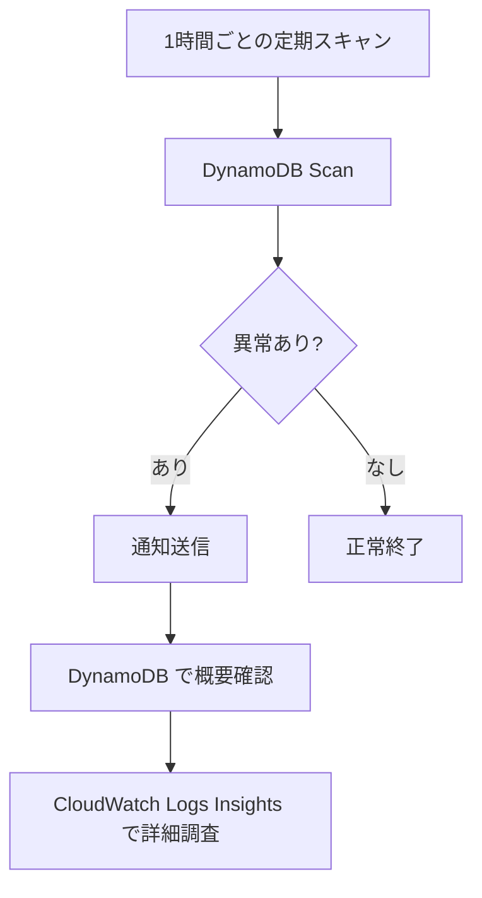

# DynamoDB & CloudWatch Logs 設計書 — 画像生成 & 課金システム (v6 最終版)

## 1. 概要と設計方針

### 1.1 DynamoDB と CloudWatch Logs の役割分担

| | DynamoDB | CloudWatch Logs |
|------|------|------|
| **目的** | 監視・通知・統計 | 障害調査・デバッグ |
| **粒度** | トランザクション単位（1処理 = 1レコード） | イベント単位（1アクション = 1ログエントリ） |
| **対象者** | 運用監視（自動通知）、管理者 | 開発者・インフラ担当 |
| **いつ見る** | 定期通知 or アラート受信時 | DB で異常検知した**後**に詳細調査 |
| **書く情報** | 状態（status）、集計値、課金結果 | リクエスト/レスポンス詳細、スタックトレース、処理時間 |
| **保持期間** | 90日（TTL） | 30〜90日（ロググループ設定） |

> [!IMPORTANT]
> **運用時の調査フロー**: 通知（異常検知） → **DynamoDB で概要把握** → **CloudWatch Logs で詳細調査**

---

## 2. 各フェーズの書き込み一覧

| フェーズ | イベント | DB | CW | 備考 |
|------|------|------|------|------|
| **Phase 0** | precheck 開始 | ❌ | 📝 | |
| | precheck 成功 | ✅ レコード作成 | 📝 | status=PRECHECK_SUCCESS |
| | 残高不足 | ✅ レコード作成 | 📝 WARN | status=PRECHECK_FAILED（**通知対象外**、後続なし） |
| | システムエラー | ✅ レコード作成 | 📝 ERROR | status=PRECHECK_ERROR（**通知対象**、後続なし） |
| **Phase 1** | URL発行成功 | ✅ status更新 | 📝 | status=UPLOAD_URL_ISSUED |
| | URL発行失敗 | ✅ status更新 | 📝 | status=ERROR |
| **Phase 2** | 画像アップロード | ❌ | ❌ | Lambda不使用 |
| **Phase 3** | 各Lambda 開始 | ❌ | 📝 | DB更新なし（並列起動のため） |
| | 各Lambda 成功 | ✅ processed_items +1 | 📝 | |
| | 各Lambda 失敗 | ✅ failed_items +1 | 📝 | CW: スタックトレース含む |
| | 全Lambda完了 | ✅ status確定 | 📝 | |
| **Phase 4** | 画像ダウンロード | ❌ | ❌ | Lambda不使用 |
| **Phase 5** | 課金成功 | ✅ status更新 | 📝 | status=SUCCESS |
| | 課金失敗 | ✅ status更新 | 📝 | status=BILLING_FAILED |

---

## 3. DynamoDB 設計

### 3.1 テーブル: `ImageProcessingTransactionLog`

| キー | 属性名 | 型 |
|------|--------|------|
| **PK** | `transactionId` | String |

**GSI**: `AccountStatusIndex` (PK: `accountId`, SK: `createdAt`)

### 3.2 レコード属性

| 属性名 | 型 | Phase | 説明 |
|--------|------|------|------|
| `transactionId` | String (PK) | 0 | 処理全体の一意ID（UUID v4）。全Lambdaに共通で渡される |
| `accountId` | String | 0 | ユーザーのアカウントID |
| `status` | String | 0,1,3,5 | 処理の現在状態（セクション3.3参照） |
| `createdAt` | String (ISO 8601) | 0 | レコード作成日時 |
| `updatedAt` | String (ISO 8601) | 0,1,3,5 | 最終更新日時 |
| `deviceId` | String | 0 | リクエスト元端末の識別子（同一アカウント・異端末の区別用） |
| `total_items` | Number | 0 | 生成要求画像枚数（例: 4） |
| `processed_items` | Number | 3 | 生成**成功**した画像枚数 |
| `failed_items` | Number | 3 | 生成**失敗**した画像枚数 |
| `detail` | List\<Map\> | 3 | 各画像の個別結果（下記参照） |
| `balanceAtPrecheck` | Number | 0 | Phase 0 時点の残高 |
| `requestedAmount` | Number | 0 | 課金予定額（全枚数分の合計） |
| `billingResult` | Map | 5 | 課金結果の詳細（下記参照） |
| `errorInfo` | Map | エラー時 | 課金以外のエラー情報（下記参照） |
| `ttl` | Number | 0 | レコード自動削除時刻（Epoch秒、例: 90日後） |

#### `billingResult` Map の中身（Phase 5 で書き込み）

| 属性 | 型 | 説明 |
|------|------|------|
| `success` | Boolean | 課金成功/失敗 |
| `billedAmount` | Number | 実際の課金額（成功枚数分。失敗時は0） |
| `billedItems` | Number | 課金対象の画像枚数（= `processed_items`） |
| `balanceAtBilling` | Number | **課金実行時点の残高**（競合検知に必須） |
| `errorCode` | String | エラーコード（失敗時のみ） |
| `errorMessage` | String | エラーメッセージ（失敗時のみ） |

> [!IMPORTANT]
> **同時アクセス競合の検知**: `balanceAtPrecheck`（Phase 0）と `billingResult.balanceAtBilling`（Phase 5）を比較する。
> - **同じ値** → 競合なし（他の処理が間に課金していない）
> - **減っている** → 他の処理が間に消費した = **競合**
>
> 例: `balanceAtPrecheck: 100` なのに `balanceAtBilling: 0` → 別トランザクションが先に100消費した

#### `errorInfo` Map の中身（課金以外のエラー時に書き込み）

| 属性 | 型 | 説明 |
|------|------|------|
| `phase` | String | エラー発生フェーズ（`PRECHECK` / `URL_ISSUE` / `GENERATION`） |
| `errorCode` | String | エラーコード |
| `errorMessage` | String | エラーメッセージ |

#### `detail` List 内の各要素（Phase 3 で各Lambda完了時に追記）

| 属性 | 型 | 説明 |
|------|------|------|
| `imageId` | String | 画像の識別子 |
| `result` | String | `SUCCESS` or `FAILED` |
| `s3Key` | String | 生成画像のS3キー（成功時のみ） |
| `errorCode` | String | エラーコード（失敗時のみ） |
| `errorMessage` | String | エラーメッセージ（失敗時のみ） |
| `completedAt` | String (ISO 8601) | 処理完了日時 |

### 3.3 status 遷移

```
PRECHECK_SUCCESS → UPLOAD_URL_ISSUED → PROCESSED → SUCCESS
                                     ↘ PROCESSED_WITH_ERRORS → SUCCESS (成功分のみ課金)
                                                             ↘ BILLING_FAILED
終端（後続処理なし）:
  PRECHECK_FAILED（残高不足 — 通知対象外）
  PRECHECK_ERROR（システムエラー — 通知対象）
  ALL_GENERATION_FAILED / ERROR
```

> [!IMPORTANT]
> **status の逆行防止**: 全ての `UpdateItem` に `ConditionExpression` を設定し、期待する現在の status からのみ遷移を許可する。詳細はセクション4参照。

### 3.4 DB書き込みコード

#### Phase 0 — precheck Lambda

```python
# 成功時: PutItem（新規作成）
table.put_item(
    Item={
        'transactionId': transaction_id,
        'accountId': account_id,
        'status': 'PRECHECK_SUCCESS',
        'createdAt': now_iso,
        'updatedAt': now_iso,
        'deviceId': device_id,
        'balanceAtPrecheck': balance,
        'requestedAmount': amount,
        'total_items': total_items,
        'processed_items': 0,
        'failed_items': 0,
        'detail': [],
        'ttl': ttl_epoch
    },
    ConditionExpression='attribute_not_exists(transactionId)'  # ★ 重複防止
)

# 残高不足時: PutItem（status=PRECHECK_FAILED、後続処理なし）
# システムエラー時: PutItem（status=PRECHECK_ERROR、後続処理なし）
```

#### Phase 1 — URL発行 Lambda

```python
table.update_item(
    Key={'transactionId': transaction_id},
    UpdateExpression='SET #s = :new_status, updatedAt = :now',
    ConditionExpression='#s = :expected AND accountId = :aid',  # ★ 逆行防止 + アカウント検証
    ExpressionAttributeNames={'#s': 'status'},
    ExpressionAttributeValues={
        ':new_status': 'UPLOAD_URL_ISSUED',
        ':expected': 'PRECHECK_SUCCESS',
        ':aid': account_id,
        ':now': now_iso
    }
)
```

#### Phase 3 — 画像生成 Lambda（詳細はセクション4）

#### Phase 5 — 課金 Lambda

```python
# 成功時
table.update_item(
    Key={'transactionId': transaction_id},
    UpdateExpression='SET #s = :new_status, updatedAt = :now, billingResult = :result',
    ConditionExpression='#s IN (:s1, :s2)',  # ★ PROCESSED or PROCESSED_WITH_ERRORS からのみ遷移
    ExpressionAttributeNames={'#s': 'status'},
    ExpressionAttributeValues={
        ':new_status': 'SUCCESS',
        ':s1': 'PROCESSED',
        ':s2': 'PROCESSED_WITH_ERRORS',
        ':now': now_iso,
        ':result': {
            'success': True,
            'billedAmount': billed_amount,
            'billedItems': processed_items,
            'balanceAtBilling': current_balance
        }
    }
)

# 失敗時: 同様に ConditionExpression で遷移元を制限、status → BILLING_FAILED
```

---

## 4. Phase 3 並列Lambda処理の詳細設計

### 4.1 設計方針

- 各Lambda 開始時は **DB更新なし**（CWログのみ）
- 各Lambda 完了時に `ADD` 演算子で `processed_items` or `failed_items` をアトミックインクリメント
- `ReturnValues='ALL_NEW'` で完了判定、最後のLambdaのみが status を確定

### 4.2 各Lambda成功時

```python
response = table.update_item(
    Key={'transactionId': transaction_id},
    UpdateExpression=(
        'SET updatedAt = :now, '
        'detail = list_append(if_not_exists(detail, :empty), :img_info) '
        'ADD processed_items :one'
    ),
    ConditionExpression='accountId = :aid',  # ★ アカウント検証
    ExpressionAttributeValues={
        ':now': now_iso,
        ':one': 1,
        ':aid': account_id,
        ':img_info': [{
            'imageId': image_id,
            'result': 'SUCCESS',
            's3Key': s3_key,
            'completedAt': now_iso
        }],
        ':empty': []
    },
    ReturnValues='ALL_NEW'
)
```

### 4.3 各Lambda失敗時

```python
response = table.update_item(
    Key={'transactionId': transaction_id},
    UpdateExpression=(
        'SET updatedAt = :now, '
        'detail = list_append(if_not_exists(detail, :empty), :img_info) '
        'ADD failed_items :one'
    ),
    ConditionExpression='accountId = :aid',
    ExpressionAttributeValues={
        ':now': now_iso,
        ':one': 1,
        ':aid': account_id,
        ':img_info': [{
            'imageId': image_id,
            'result': 'FAILED',
            'errorCode': error_code,
            'errorMessage': str(e),
            'completedAt': now_iso
        }],
        ':empty': []
    },
    ReturnValues='ALL_NEW'
)
```

### 4.4 全Lambda完了判定

```python
updated = response['Attributes']
completed = updated['processed_items'] + updated['failed_items']

if completed >= updated['total_items']:
    # ★ このLambdaが最後 → status を確定
    if updated['failed_items'] == 0:
        new_status = 'PROCESSED'
    elif updated['processed_items'] == 0:
        new_status = 'ALL_GENERATION_FAILED'
    else:
        new_status = 'PROCESSED_WITH_ERRORS'

    table.update_item(
        Key={'transactionId': transaction_id},
        UpdateExpression='SET #s = :status, updatedAt = :now',
        ConditionExpression='#s = :expected',  # ★ UPLOAD_URL_ISSUED からのみ遷移
        ExpressionAttributeNames={'#s': 'status'},
        ExpressionAttributeValues={
            ':status': new_status,
            ':expected': 'UPLOAD_URL_ISSUED',
            ':now': now_iso
        }
    )
```

> [!IMPORTANT]
> **アトミック性の保証**: `ADD` 演算子は DynamoDB がサーバサイドで処理するアトミック操作。複数Lambdaが同時に `UpdateItem` しても正確にカウントされる。`ReturnValues='ALL_NEW'` は更新後の最新値を返すため、`completed >= total` を満たすのは **必ず1つの Lambda のみ**。追加の排他制御は不要。

### 4.5 Lambda 自主タイムアウト対策

Lambda が AWS 側のタイムアウトで強制終了されると、`processed_items` も `failed_items` もインクリメントされず、`completed < total` のまま永遠に完了しない。

**対策**: Lambda 内で残り時間を監視し、**タイムアウト前に自主的に `failed_items` をインクリメント**する。

```python
def handler(event, context):
    transaction_id = event['transactionId']
    image_id = event['imageId']

    try:
        result = generate_image(event, context)  # 画像生成処理

        # ★ 生成中に残り時間チェック（処理の区切りごとに呼ぶ）
        if context.get_remaining_time_in_millis() < 5000:
            raise TimeoutError("残り時間不足で処理を中断")

        upload_to_s3(result)
        increment_processed(transaction_id, image_id, ...)  # 4.2 の処理

    except Exception as e:
        # タイムアウト含む全エラーで failed_items をインクリメント
        increment_failed(transaction_id, image_id, e, ...)  # 4.3 の処理

        # CW にエラーログ出力
        log_error(transaction_id, image_id, e)
```

> [!TIP]
> `context.get_remaining_time_in_millis()` は Lambda の残り実行時間をミリ秒で返す。5秒の余裕を持って処理を打ち切ることで、DynamoDB への書き込みを完了させてから終了できる。

---

## 5. CloudWatch Logs 設計

### 5.1 設計原則

| 原則 | 内容 |
|------|------|
| **構造化JSON** | 全ログを JSON で出力。Logs Insights でクエリ可能 |
| **`transactionId` 必須** | 全エントリに含める。DB→CW紐付けに必須 |
| **ログレベル** | `INFO` / `WARN` / `ERROR` |
| **リクエストID** | `context.aws_request_id` 含める（再試行識別用） |

### 5.2 共通フォーマット

```json
{
  "timestamp": "2026-03-01T12:00:00.123Z",
  "level": "INFO | WARN | ERROR",
  "transactionId": "uuid-xxx",
  "accountId": "account-123",
  "lambdaRequestId": "aws-request-id",
  "phase": "PRECHECK | URL_ISSUE | GENERATION | BILLING",
  "event": "イベント名",
  "details": { ... }
}
```

### 5.3 各フェーズの CW ログ

#### Phase 0 — precheck Lambda

| イベント | レベル | `event` | `details` に含めるもの |
|------|------|------|------|
| 開始 | INFO | `PRECHECK_STARTED` | deviceId, requestedAmount, total_items, clientIp |
| 成功 | INFO | `PRECHECK_SUCCEEDED` | balanceAtPrecheck, requestedAmount, durationMs |
| 残高不足 | **WARN** | `PRECHECK_FAILED_INSUFFICIENT_BALANCE` | reason, balance, amount, billingSystemResponse, durationMs |
| システムエラー | **ERROR** | `PRECHECK_ERROR` | reason, errorType, errorMessage, stackTrace, durationMs |

> [!TIP]
> 残高不足 = `WARN`（正常な業務エラー、通知対象外）/ システムエラー = `ERROR`（通知対象）

#### Phase 1 — URL発行 Lambda

| イベント | レベル | `event` | `details` に含めるもの |
|------|------|------|------|
| 開始 | INFO | `URL_ISSUE_STARTED` | s3Bucket, s3KeyPrefix |
| 成功 | INFO | `URL_ISSUE_SUCCEEDED` | presignedUrlCount, urlExpiresInSeconds, durationMs |
| 失敗 | ERROR | `URL_ISSUE_FAILED` | errorType, errorMessage, stackTrace, durationMs |

#### Phase 3 — 画像生成 Lambda

| イベント | レベル | `event` | `details` に含めるもの |
|------|------|------|------|
| 開始 | INFO | `GENERATION_STARTED` | imageId, imageIndex, total_items, inputS3Key, generationParams |
| 成功 | INFO | `GENERATION_SUCCEEDED` | imageId, outputS3Key, fileSizeBytes, durationMs, processedItemsAfterUpdate |
| 失敗 | ERROR | `GENERATION_FAILED` | imageId, errorType, errorMessage, stackTrace, inputS3Key, durationMs |
| 全完了 | INFO | `ALL_GENERATION_COMPLETED` | finalStatus, total_items, processed_items, failed_items, totalDurationMs |

#### Phase 5 — 課金 Lambda

| イベント | レベル | `event` | `details` に含めるもの |
|------|------|------|------|
| 開始 | INFO | `BILLING_STARTED` | accountId, billedItems, billedAmount, previousStatus |
| 成功 | INFO | `BILLING_SUCCEEDED` | billedAmount, billedItems, balanceBefore, balanceAfter, billingSystemResponse, durationMs |
| 失敗 | ERROR | `BILLING_FAILED` | billedAmount, balanceAtBilling, reason, billingSystemResponse, durationMs |

#### DynamoDB 更新エラー（全フェーズ共通）

```json
{
  "level": "ERROR",
  "transactionId": "uuid-xxx",
  "event": "DYNAMODB_UPDATE_FAILED",
  "details": {
    "operation": "UpdateItem",
    "errorType": "ProvisionedThroughputExceededException",
    "errorMessage": "...",
    "retryAttempt": 3,
    "stackTrace": "..."
  }
}
```

---

## 6. 同一アカウント同時アクセスの課金競合

### 6.1 シナリオ

残高100で2端末が同時に100消費する処理を実行:

| 時刻 | トランザクションA (端末1) | トランザクションB (端末2) |
|------|------|------|
| T0 | `PRECHECK_SUCCESS` (残高100) | `PRECHECK_SUCCESS` (残高100) |
| T1 | `UPLOAD_URL_ISSUED` | `UPLOAD_URL_ISSUED` |
| T2 | `PROCESSED` | `PROCESSED` |
| T3 | **`SUCCESS`** (課金100、残高→0) | — |
| T4 | — | **`BILLING_FAILED`** (残高不足) |

### 6.2 DB レコードでの見え方

| 属性 | トランザクションA | トランザクションB |
|------|------|------|
| `accountId` | account-123 | account-123（**同一**） |
| `deviceId` | device-001 | device-002（**異なる端末**） |
| `balanceAtPrecheck` | **100** | **100** |
| `billingResult.balanceAtBilling` | **100** | **0** ← ★ ここで競合が分かる |
| `billingResult.success` | true | false |
| `status` | `SUCCESS` | `BILLING_FAILED` |

> [!IMPORTANT]
> **競合の判定**: 1レコードだけで判定可能。
> `balanceAtPrecheck: 100` なのに `balanceAtBilling: 0` → Phase 0 から Phase 5 の間に別の処理が残高を消費した = **競合**

### 6.3 通知での自動検知

スキャン用Lambda が `BILLING_FAILED` を検出した際、`AccountStatusIndex` GSI を使って同一 `accountId` の近接レコードを自動取得し、通知に含める:

```
🔴 課金失敗（残高競合の可能性）:
  transactionId: uuid-bbb
  accountId: account-123 | deviceId: device-002
  status: BILLING_FAILED
  balanceAtPrecheck: 100 → balanceAtBilling: 0  ← ★ 残高が減っている
  requestedAmount: 100
  ─── 競合の可能性があるトランザクション ───
  transactionId: uuid-aaa | deviceId: device-001
  status: SUCCESS | createdAt差: 2分
  billedAmount: 100
```

---

## 7. 未完了処理の検知と通知

### 7.1 スケジュール

**9:00〜17:00、1時間に1回** EventBridge → スキャン用Lambda

### 7.2 検知ロジック

`Scan` + `FilterExpression`:
```
status NOT IN ('SUCCESS', 'PRECHECK_FAILED', 'ALL_GENERATION_FAILED')
AND updatedAt < (現在時刻 - 1時間)
```

| 検出パターン | 緊急度 |
|------|------|
| `BILLING_FAILED` | 🔴 課金漏れ |
| `PROCESSED` / `PROCESSED_WITH_ERRORS` で1h経過 | 🔴 課金漏れリスク |
| `PRECHECK_ERROR` | 🟠 システム障害 |
| `UPLOAD_URL_ISSUED` で1h経過 | 🟡 処理停止 |
| `PRECHECK_SUCCESS` で1h経過 | 🟡 処理停止 |

### 7.3 通知例

```
[ALERT] 未完了トランザクション検知 (2026-03-01 13:00)
━━━━━━━━━━━━━━━━━━━━━━━━━━━━━━
🔴 課金漏れリスク:
  transactionId: uuid-aaa
  accountId: account-123 | deviceId: device-abc
  status: PROCESSED_WITH_ERRORS
  total_items: 4 | processed_items: 3 | failed_items: 1
  requestedAmount: 100
  → 3枚分の課金が未実行
━━━━━━━━━━━━━━━━━━━━━━━━━━━━━━
```

---

## 8. 運用時の調査フロー



### 調査シナリオ

#### ① `PROCESSED_WITH_ERRORS` で停止
1. DB: `processed_items: 3, failed_items: 1, total_items: 4`, `detail` で失敗画像を特定
2. CW: `filter transactionId = "uuid-xxx"` でスタックトレース確認

#### ② `BILLING_FAILED`（同時アクセス競合の疑い）
1. DB: `balanceAtPrecheck` と `billingResult.balanceAtBilling` を比較
2. DB: `AccountStatusIndex` で同一 `accountId` の近接レコードを確認
3. CW: 課金システムの応答を確認

#### ③ `UPLOAD_URL_ISSUED` で長時間停止
1. CW: `filter transactionId = "uuid-xxx" AND phase = "GENERATION"` → 0件ならクライアント側の問題

---

## 9. CloudWatch Logs Insights クエリ集

```sql
-- トランザクション全体の時系列
fields @timestamp, phase, event, level
| filter transactionId = "uuid-xxx"
| sort @timestamp asc

-- 特定期間のエラー一覧
fields @timestamp, transactionId, phase, event, details.errorMessage
| filter level = "ERROR" AND @timestamp >= "2026-03-01T09:00:00Z"
| sort @timestamp desc | limit 50

-- 画像生成の失敗パターン分析
stats count(*) as cnt by details.errorType
| filter phase = "GENERATION" AND event = "GENERATION_FAILED"

-- 課金失敗の一覧（競合分析用）
fields @timestamp, transactionId, details.balanceAtBilling, details.billedAmount
| filter phase = "BILLING" AND event = "BILLING_FAILED"

-- 処理時間の統計
stats avg(details.durationMs) as avg, max(details.durationMs) as max by phase, event
| filter event in ["PRECHECK_SUCCEEDED","GENERATION_SUCCEEDED","BILLING_SUCCEEDED"]
```

---

## 10. DB と CW の役割対比表

| 情報 | DB | CW | 理由 |
|------|------|------|------|
| status（処理状態） | ✅ | ❌ | 監視・通知の根幹 |
| processed/failed_items | ✅ | ❌ | 部分失敗の把握 |
| detail（各画像の結果+S3キー） | ✅ | ❌ | 通知時の概要 |
| balanceAtPrecheck | ✅ | ❌ | 競合分析 |
| billingResult | ✅ | ❌ | 課金結果の記録 |
| 開始/終了イベント | ❌ | ✅ | 時系列追跡 |
| 処理時間 (durationMs) | ❌ | ✅ | パフォーマンス分析 |
| リクエスト/レスポンス詳細 | ❌ | ✅ | 外部システムの診断 |
| スタックトレース | ❌ | ✅ | デバッグ専用 |
| clientIp | ❌ | ✅ | 不正アクセス調査 |
| 生成パラメータ | ❌ | ✅ | 再現調査 |

> [!IMPORTANT]
> **DB** = 「何が起きたか」（通知を受けた人が最初に見る）/ **CW** = 「なぜ起きたか」（詳細調査用）

---

## 11. 設計まとめ

| 項目 | 方針 |
|------|------|
| 1トランザクション = 1レコード | `UpdateItem` で段階的に更新 |
| **status 逆行防止** | 全 `UpdateItem` に `ConditionExpression` で遷移元を検証 |
| Lambda不使用フェーズ (2, 4) | DB更新なし、CWログなし |
| 並列Lambda開始時 | DB更新なし、CWのみ |
| `processed_items` / `failed_items` | `ADD` 演算子でアトミックインクリメント |
| **完了判定の一意性** | `ReturnValues='ALL_NEW'` により最後の1Lambdaのみが status 確定 |
| 部分失敗 | `PROCESSED_WITH_ERRORS` + `detail` で個別の成功/失敗を記録 |
| 課金 | `processed_items` 分のみ |
| **Lambda タイムアウト対策** | `context.get_remaining_time_in_millis()` で自主タイムアウト、確実に `failed_items` をインクリメント |
| CWログ | 構造化JSON、`transactionId` 必須、Logs Insights対応 |
| precheck 残高不足 | `PRECHECK_FAILED` で記録するが**通知対象外** |
| precheck システムエラー | `PRECHECK_ERROR` で記録し**通知対象** |
| 通知 | 9-17時に1時間間隔で `Scan` |
| TTL | 必ず設定（90日） |
